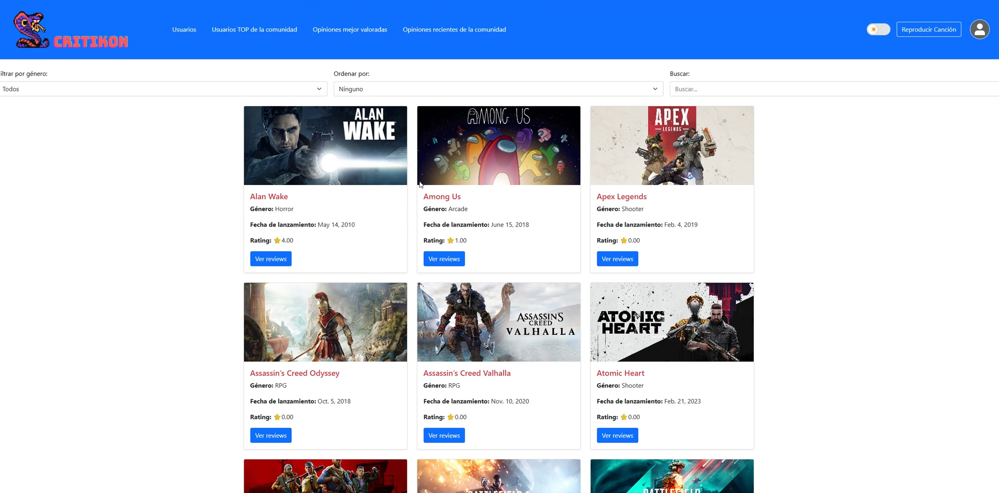
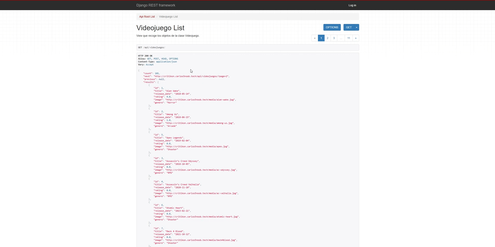
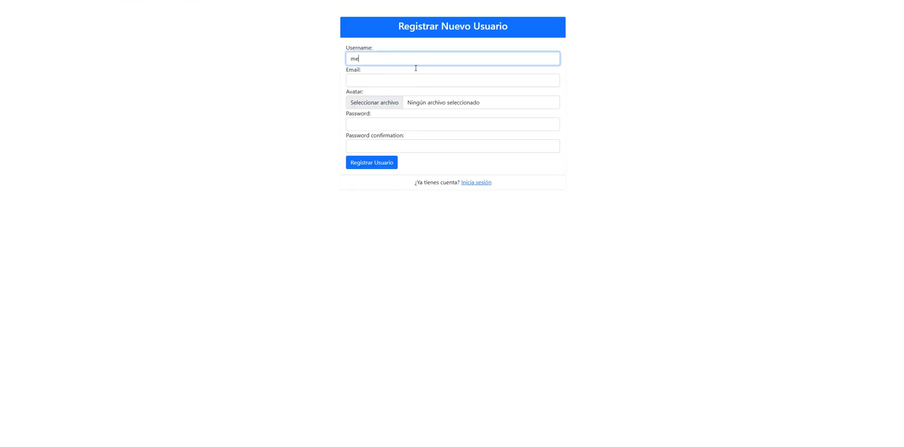
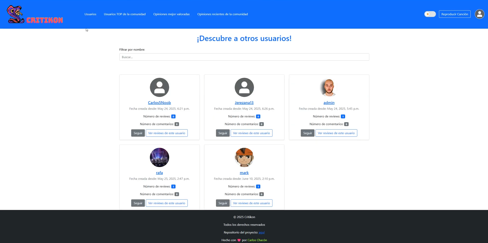
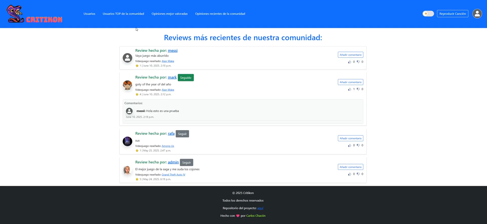

# CRITIKON  

---

## 📌 Website Overview
**CRITIKON** is a web platform where users can write detailed reviews about a wide variety of video games, share feedback, interact with other players, and engage in a community built around gaming culture.

The primary goal of CRITIKON is to create a welcoming environment for gamers where they can freely express their thoughts, discover new titles, connect with players with similar interests, and enjoy a personalized experience that enhances their passion for video games.

---

## 🎮 API Information
Users can access data for **up to 101 real video games — completely free** through the integrated external API.

For each game, the system retrieves:

- Title  
- Release date  
- Platform rating  
- Cover image  
- Genre  

---

## 🚀 Core Features
- Create detailed video game reviews.  
- Comment on reviews made by other users.  
- Like and provide feedback on community posts.  
- User following system (followers & following).  
- Automatic retrieval of video game data from the official external API.  
- And much more!

---

## 🛠️ Technologies Used
- **Django** — Web framework  
- **Django Rest Framework** — RESTful API  
- **Bootstrap 5** — Responsive UI  

---

## 🖼️ Screenshots

---

## 🌐 Web Deployment
The project is fully configured and prepared for deployment on an **AWS EC2 instance**, including environment setup and containerization.

However, the application is **not currently running**, as the previous deployment relied on an AWS Free Tier instance, which has expired.

This means:

- The project is ready for instant redeployment on EC2.  
- All configuration files and deployment settings are already included.  
- The buyer can deploy it again in minutes by launching a new instance.  

This makes CRITIKON an excellent option for anyone looking for a **ready-to-launch Django web application with API integration**.

---

## 👨‍💻 Project Developer
[Carlos Chacón Atienza](https://portfolio-carlos5noob.vercel.app/)
